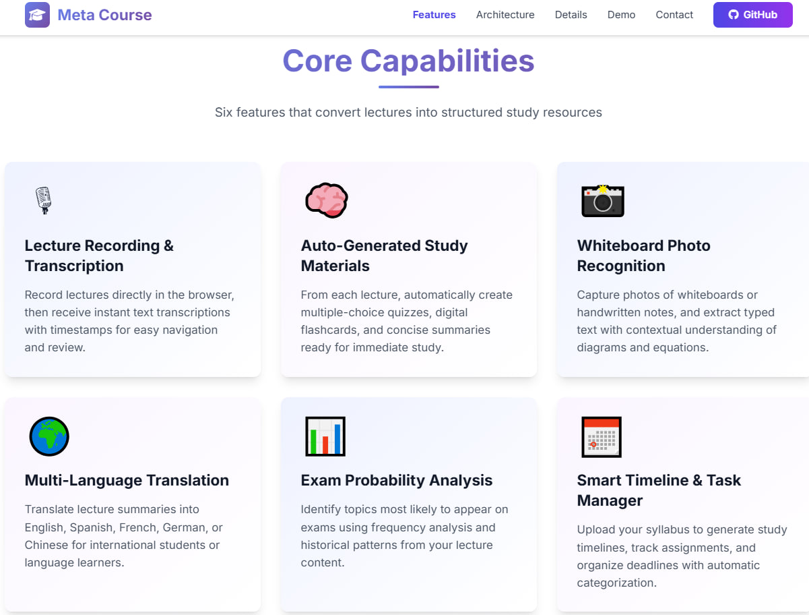

# 🎓 Meta Course

[](https://opensource.org/licenses/MIT)
[](https://reactjs.org/)
[](https://www.typescriptlang.org/)
[](https://meta-course.github.io/)

**Record Lectures. Analyze Content. Study Smarter.**

Meta Course is an educational platform that transforms lecture recordings and whiteboard images into structured study materials. Built with React and TypeScript, it leverages Gemini 2.5 Flash to automatically generate quizzes, flashcards, summaries, and exam predictions from your lecture content.



---

## ✨ Features

### 🎙 **Lecture Recording & Transcription**
Record lectures directly in the browser and receive instant text transcriptions with timestamps for easy navigation and review.

### 🧠 **Auto-Generated Study Materials**
Automatically create multiple-choice quizzes, digital flashcards, and concise summaries from each lecture, ready for immediate study.

### 📸 **Whiteboard Photo Recognition**
Capture photos of whiteboards or handwritten notes and extract typed text with contextual understanding of diagrams and equations.

### 🌍 **Multi-Language Translation**
Translate lecture summaries into English, Spanish, French, German, or Chinese for international students or language learners.

### 📊 **Exam Probability Analysis**
Identify topics most likely to appear on exams using frequency analysis and historical patterns from your lecture content.

### 📅 **Smart Timeline & Task Manager**
Upload your syllabus to generate study timelines, track assignments, and organize deadlines with automatic categorization.

---

## 🏗️ Technical Architecture

| Component | Technology |
|-----------|-----------|
| **Frontend Framework** | React 18 with TypeScript |
| **AI Processing** | Gemini 2.5 Flash (Multimodal) |
| **Data Storage** | LocalStorage (Browser-based) |
| **UI Styling** | Tailwind CSS |
| **Architecture** | 7 Core Components + 2 Service Modules |

### Key Technical Features

- ✅ **Type-Safe Development**: Full TypeScript implementation for robust, maintainable code
- ✅ **Privacy-First**: All recordings and notes stored locally on your device
- ✅ **Multimodal Processing**: Handles both audio transcriptions and visual content
- ✅ **Responsive Design**: Optimized for mobile, tablet, and desktop devices
- ✅ **No Backend Required**: Runs entirely in the browser with external API calls only for processing

---

## 🚀 Getting Started

### Prerequisites

- Modern web browser (Chrome, Firefox, Edge, Safari)
- Microphone access for lecture recording
- Camera access for whiteboard photo capture (optional)

### Installation

No installation required! Simply visit:

**[https://meta-course.github.io/](https://meta-course.github.io/)**

---

## 📖 How It Works

1. **Record** - Capture lecture audio directly in your browser
2. **Process** - AI analyzes and transcribes the content
3. **Generate** - Automatically create quizzes, flashcards, and summaries
4. **Study** - Review with optimized, structured materials

---

## 🛠️ Development

### Project Structure

```
meta-course.github.io/
├── index.html          # Main landing page
├── styles.css          # Custom CSS animations and styles
├── script.js           # Interactive functionality
├── Features.jpg        # Feature showcase image
└── README.md          # This file
```

### Technologies Used

- **Frontend**: React 18, TypeScript
- **Styling**: Tailwind CSS (CDN), Custom CSS
- **Icons**: Font Awesome 6.5.1
- **Fonts**: Google Fonts (Inter)
- **Animations**: AOS (Animate On Scroll)
- **AI**: Google Gemini 2.5 Flash API

### Local Development

1. Clone the repository:
```bash
git clone https://github.com/Meta-Course/meta-course.github.io.git
cd meta-course.github.io
```

2. Open `index.html` in your browser or use a local server:
```bash
# Using Python
python -m http.server 8000

# Using Node.js
npx http-server
```

3. Navigate to `http://localhost:8000`

---

## 🌟 Key Highlights

- **🔒 Privacy-Focused**: No cloud uploads, data stays on your device
- **⚡ Real-Time Processing**: Instant transcriptions and analysis
- **🎨 Modern UI/UX**: Beautiful, intuitive interface with smooth animations
- **📱 Cross-Platform**: Works seamlessly on all devices
- **🌐 Multi-Language**: Support for 5 major languages
- **🎯 Smart Analytics**: Exam probability predictions based on content analysis

---

## 📊 Statistics

- **7** Core Components
- **5** Supported Languages
- **2** Fully-Typed Service Modules
- **0** Backend Dependencies

---

## 🤝 Contributing

Contributions are welcome! Please feel free to submit a Pull Request.

1. Fork the repository
2. Create your feature branch (`git checkout -b feature/AmazingFeature`)
3. Commit your changes (`git commit -m 'Add some AmazingFeature'`)
4. Push to the branch (`git push origin feature/AmazingFeature`)
5. Open a Pull Request

---

## 📝 License

This project is licensed under the MIT License - see the [LICENSE](LICENSE) file for details.

---

## 📧 Contact

**GitHub**: [@Meta-Course](https://github.com/Meta-Course)

**Website**: [https://meta-course.github.io/](https://meta-course.github.io/)

---

## 🙏 Acknowledgments

- Google Gemini API for AI-powered content analysis
- React team for the excellent framework
- Tailwind CSS for the utility-first CSS framework
- Font Awesome for the comprehensive icon library
- AOS Library for scroll animations

---

<div align="center">

**Built for students who want better study tools.**

</div>
